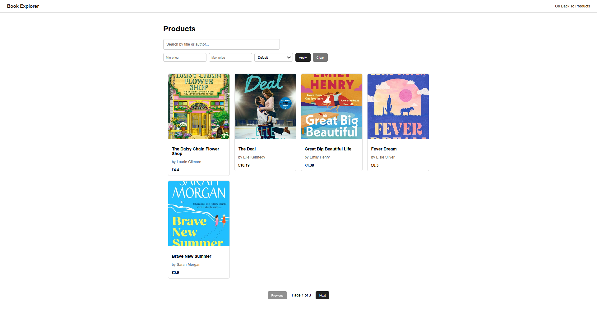
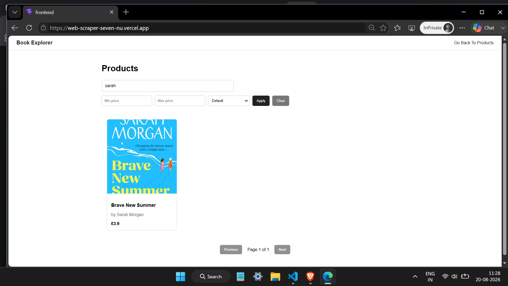
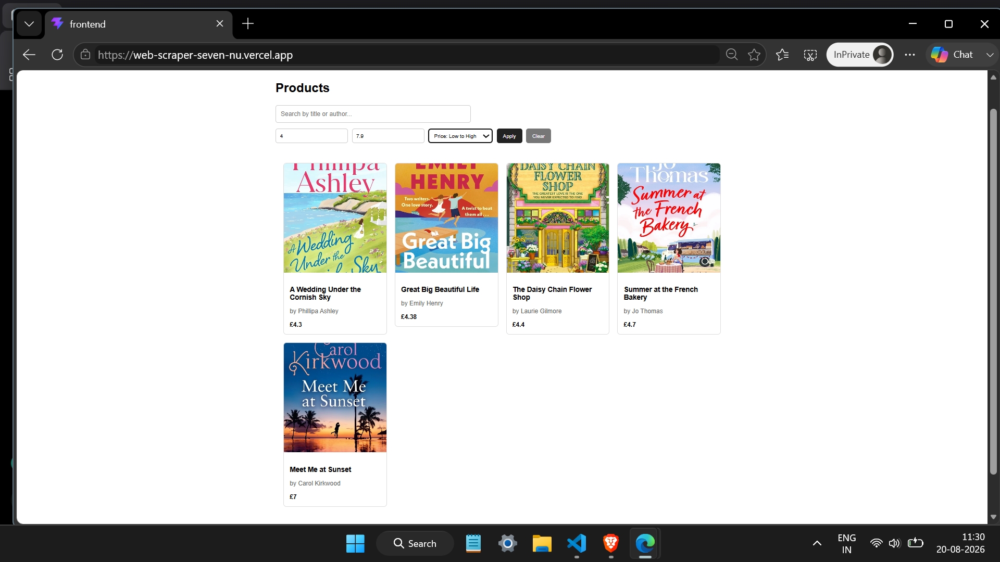
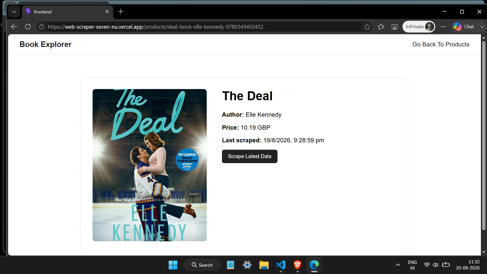

# Web Scraper & Product Explorer

## Overview

A full-stack MERN application that scrapes book data from World of Books, stores it in MongoDB, and provides a responsive interface for browsing, searching, filtering, sorting, and updating product information.

## Features

- Scrape product data using Playwright
- Store product data in MongoDB Atlas
- Search by title or author
- Filter products by price range
- Sort products by price
- Pagination support
- Product details page
- Re-scrape individual products
- Responsive user interface

## Tech Stack

### Frontend

- React
- React Router
- Vite
- CSS

### Backend

- Node.js
- Express.js
- MongoDB
- Mongoose
- Playwright

### Deployment

- Vercel
- Render
- MongoDB Atlas

## API Endpoints

### Get Products

GET /api/products

### Get Product Details

GET /api/products/:slug

### Re-Scrape Product

POST /api/products/:slug/scrape

### Health Check

GET /health

## Getting Started

### Prerequisites

Make sure you have the following installed:

- Node.js
- npm
- MongoDB Atlas account

### 1. Clone the Repository

```bash
git clone https://github.com/akshaygolange/web-scraper.git
cd web-scraper
```

### 2. Backend Setup

```bash
cd backend
npm install
```

Create a `.env` file inside the `backend` folder:

```env
PORT=5000
MONGO_URI=your_mongodb_connection_string
CLIENT_URL=http://localhost:5173
```

Start the backend:

```bash
npm start
```

The backend will run on:

```text
http://localhost:5000
```

### 3. Frontend Setup

Open another terminal:

```bash
cd frontend
npm install
```

Create the environment file:

```text
.env.development
```

Add:

```env
VITE_API_URL=http://localhost:5000
```

Start the frontend:

```bash
npm run dev
```

The frontend will run on:

```text
http://localhost:5173
```

### 4. Open the Application

Open the frontend URL in your browser:

```text
http://localhost:5173
```

The React frontend communicates with the Express backend through the configured `VITE_API_URL`.

## Environment Variables

### Backend

| Variable     | Description                     |
| ------------ | ------------------------------- |
| `PORT`       | Local server port               |
| `MONGO_URI`  | MongoDB Atlas connection string |
| `CLIENT_URL` | Frontend URL used for CORS      |

Local:

```env
CLIENT_URL=http://localhost:5173
```

Production:

```env
CLIENT_URL=https://web-scraper-seven-nu.vercel.app
```

### Frontend

| Variable       | Description          |
| -------------- | -------------------- |
| `VITE_API_URL` | Backend API base URL |

Local:

```env
VITE_API_URL=http://localhost:5000
```

Production:

```env
VITE_API_URL=https://web-scraper-zb6t.onrender.com
```


## Live Demo

[Frontend](https://web-scraper-seven-nu.vercel.app)

[Backend API](https://web-scraper-zb6t.onrender.com)

## Key Learnings

- Web scraping using Playwright
- REST API development with Express
- MongoDB querying, filtering, and pagination
- Environment variable management
- CORS configuration
- Full-stack deployment using Render and Vercel

## Architecture

User
  │
  ▼
React Frontend (Vercel)
  │
  │ REST API
  ▼
Express API (Render)
  │
  ├──────────────► MongoDB Atlas
  │
  └──────────────► Playwright
                         │
                         ▼
                  World of Books
                         │
                         │ Scraped Data
                         ▼
                    MongoDB Atlas


## Screenshots

### Products Page



### Search & Filtering





### Product Details

